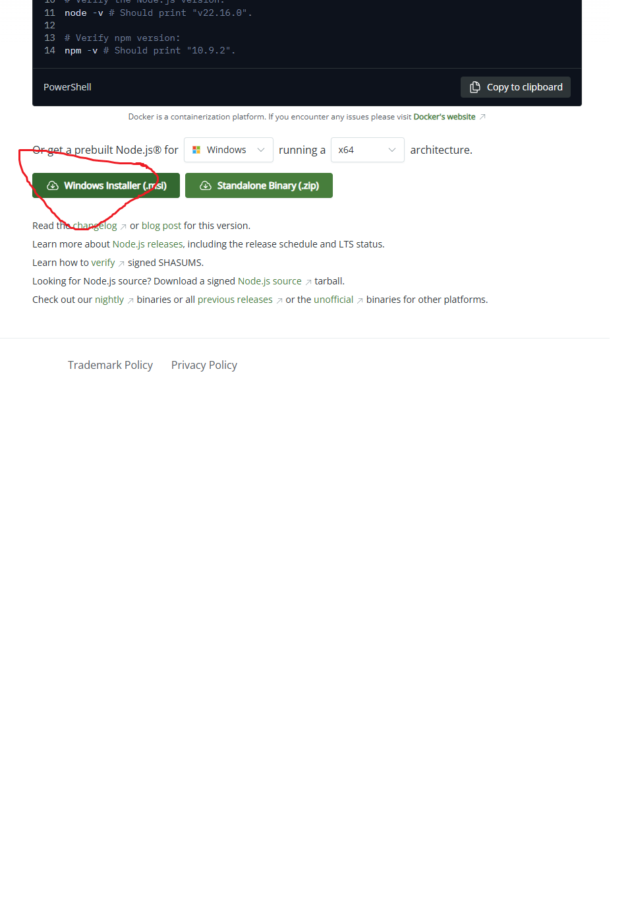
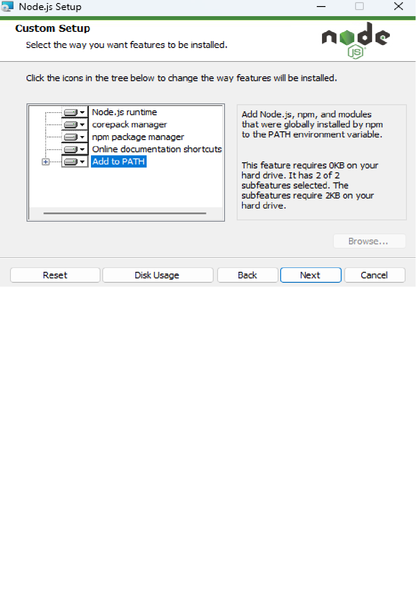
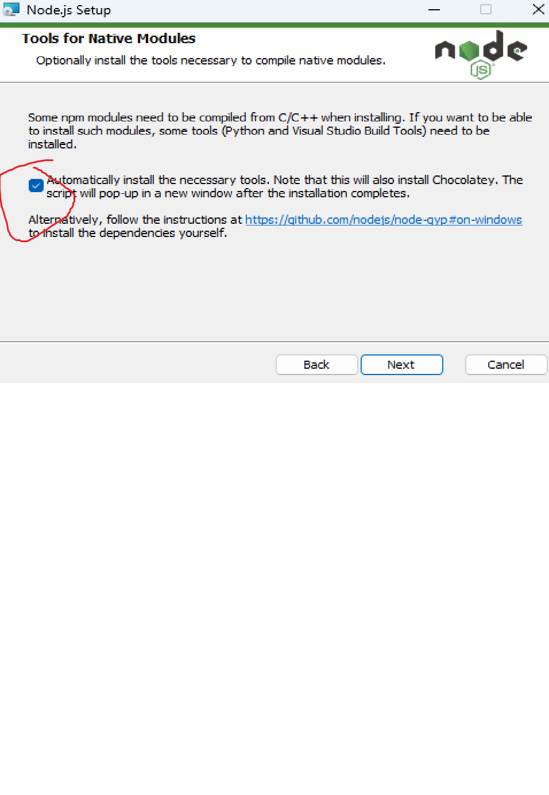
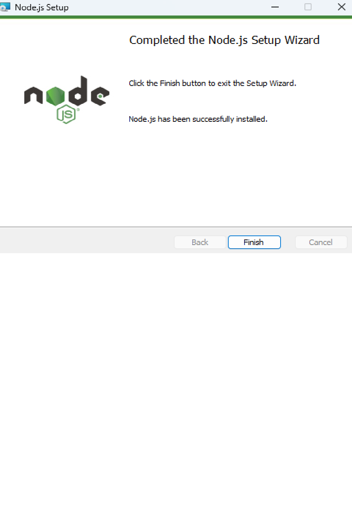
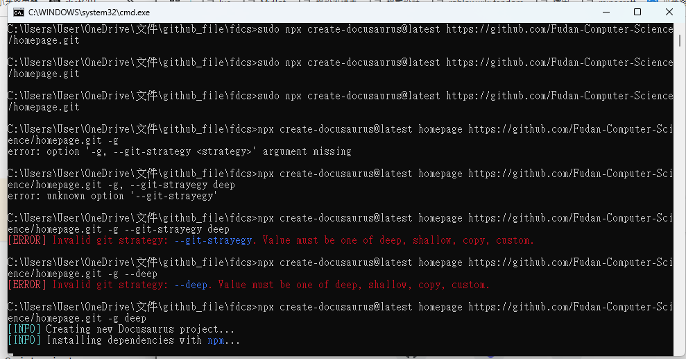
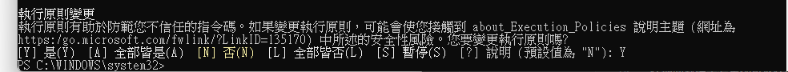

# Website
## 本地修改指南  
下載Node.js
https://nodejs.org/en/download/




```shell
cd 你想要放檔案的位置
npx create-docusaurus@latest homepage https://github.com/Fudan-Computer-Science/homepage.git -g deep
```

^最下面的才是對的

成功!!!  

### 執行
在terminal打
```shell
npx docusaurus start
#如果遇到檔案 C:\Program Files\nodejs\npm.ps1 未經數位簽署。您無法在目前的系統上執行此指令碼。
#則用管理員權限打開shell
#輸入
Set-ExecutionPolicy -ExecutionPolicy Bypass
```

之後打開 http://localhost:3000/homepage 就可以看到網站了  
在期間對檔案變更都可以在http://localhost:3000/homepage上顯示  
在terminal打 ctrl-C 中止

### 提交變更
```
git request-pull
```
當屆幹部應該會看完之後幫你merge回main
